# Modelo de Dados — Sala de Reunião v2

ERD e definição detalhada de tabelas para Postgres, alinhado ao PRD (playbooks, briefing, outputs, live summary, tasks hub, decision log, evidências, fact-check, Q&A, webhooks, highlights, roleplay, governança).

**IDs sugeridos:** ULID (ordenável por tempo) ou UUIDv7.

---

## 1) Diagrama ERD (Mermaid)

Renderize em qualquer viewer que suporte Mermaid (GitHub, GitLab, VS Code, etc.).

```mermaid
erDiagram
  WORKSPACES ||--o{ WORKSPACE_MEMBERS : has
  USERS ||--o{ WORKSPACE_MEMBERS : joins

  WORKSPACES ||--o{ INTEGRATION_SETTINGS : has
  WORKSPACES ||--o{ INTEGRATION_CONNECTIONS : connects
  WORKSPACES ||--o{ WEBHOOKS : has
  WORKSPACES ||--|| WORKSPACE_POLICIES : enforces
  WORKSPACES ||--o{ AUDIT_LOGS : records

  WORKSPACES ||--o{ AI_AGENTS : owns
  AI_AGENTS ||--o{ AGENT_VERSIONS : versions
  AI_AGENTS ||--o{ AGENT_KNOWLEDGE : knowledge
  AI_AGENTS ||--o{ AGENT_MEMORIES : memories

  WORKSPACES ||--o{ MEETING_PLAYBOOKS : has
  MEETING_PLAYBOOKS ||--o{ PLAYBOOK_STEPS : defines
  MEETING_PLAYBOOKS ||--o{ AGENT_TEMPLATES : suggests

  WORKSPACES ||--o{ CONTACTS : has
  WORKSPACES ||--o{ DEALS : has
  DEALS ||--o{ DEAL_CONTACTS : links
  CONTACTS ||--o{ DEAL_CONTACTS : links

  WORKSPACES ||--o{ MEETINGS : runs
  MEETINGS ||--o{ MEETING_AGENTS : includes
  AI_AGENTS ||--o{ MEETING_AGENTS : participates

  MEETINGS ||--o{ MEETING_PARTICIPANTS : has
  USERS ||--o{ MEETING_PARTICIPANTS : attends
  CONTACTS ||--o{ MEETING_PARTICIPANTS : attends

  MEETINGS ||--o{ TRANSCRIPTS : logs
  TRANSCRIPTS ||--o{ TRANSCRIPT_EVIDENCE : cites

  WORKSPACES ||--o{ OUTPUT_TEMPLATES : defines
  MEETINGS ||--o{ MEETING_ARTIFACTS : produces
  OUTPUT_TEMPLATES ||--o{ MEETING_ARTIFACTS : basedOn

  MEETINGS ||--o{ ACTION_ITEMS : creates
  TRANSCRIPTS ||--o{ ACTION_ITEMS : source

  MEETINGS ||--o{ DECISIONS : creates
  TRANSCRIPTS ||--o{ DECISIONS : source

  MEETINGS ||--|| MEETING_LIVE_STATE : maintains
  MEETINGS ||--o{ FACT_CHECK_REPORTS : generates

  MEETINGS ||--o{ HIGHLIGHTS : extracts

  WORKSPACES ||--o{ ROLEPLAY_SCENARIOS : has
  MEETINGS ||--o{ ROLEPLAY_REPORTS : outputs
  ROLEPLAY_SCENARIOS ||--o{ ROLEPLAY_REPORTS : basedOn

  MEETINGS ||--o{ MEETING_CONTEXT_LINKS : links
  DEALS ||--o{ MEETING_CONTEXT_LINKS : links
  CONTACTS ||--o{ MEETING_CONTEXT_LINKS : links
```



---

## 2) Tabelas detalhadas

### 2.1 Core: Workspaces e Usuários

**workspaces**

| Campo          | Tipo        | Descrição                          |
|----------------|-------------|------------------------------------|
| id             | pk          |                                    |
| name           | string      |                                    |
| plan_id        | fk          | subscription_plans                 |
| timezone       | string      | default "America/Sao_Paulo"        |
| language       | string      | ex.: pt-BR                         |
| branding_json  | jsonb       | logo, cores, etc.                  |
| created_at     | timestamptz |                                    |
| updated_at     | timestamptz |                                    |
| deleted_at     | timestamptz | soft delete                        |

- Índices: `(plan_id)`, `(deleted_at)`

**users**

| Campo            | Tipo        | Descrição     |
|------------------|-------------|---------------|
| id               | pk          |               |
| email            | string      | unique        |
| password_hash    | string      | se auth email/senha |
| name             | string      |               |
| avatar_url       | string      |               |
| company, title   | string      |               |
| preferences_json | jsonb       |               |
| created_at       | timestamptz |               |
| updated_at       | timestamptz |               |
| deleted_at       | timestamptz | soft delete   |

**workspace_members**

| Campo         | Tipo        | Descrição                    |
|---------------|-------------|-----------------------------|
| id            | pk          |                             |
| workspace_id  | fk          | workspaces                  |
| user_id       | fk          | users                       |
| roles         | text[]      | ex.: ["workspace_admin","moderator"] |
| status        | string      | active \| invited \| suspended |
| created_at    | timestamptz |                             |

- Constraint: `UNIQUE (workspace_id, user_id)`

---

### 2.2 Integrações

**integration_settings** (já existente, evoluir)

| Campo         | Tipo        | Descrição                          |
|---------------|-------------|------------------------------------|
| id            | pk          |                                    |
| workspace_id  | fk          |                                    |
| provider      | string      | openai \| anthropic \| serper \| elevenlabs \| ... |
| settings_json | jsonb       | api_key (cripto), model defaults   |
| created_at    | timestamptz |                                    |
| updated_at    | timestamptz |                                    |

- Recomendação: segredos criptografados (KMS/env); nunca devolver segredo completo na API.

**integration_connections** (OAuth / conectores)

| Campo      | Tipo        | Descrição                              |
|------------|-------------|----------------------------------------|
| id         | pk          |                                        |
| workspace_id | fk        |                                        |
| provider   | string      | slack \| jira \| notion \| hubspot \| google \| microsoft \| ... |
| auth_type  | string      | oauth \| api_key \| custom              |
| auth_json  | jsonb       | tokens, refresh, scopes (criptografado)|
| status     | string      | connected \| revoked \| error          |
| created_at | timestamptz |                                        |
| updated_at | timestamptz |                                        |

---

### 2.3 Agentes

**ai_agents**

| Campo          | Tipo        | Descrição                          |
|----------------|-------------|------------------------------------|
| id             | pk          |                                    |
| workspace_id   | fk          |                                    |
| name           | string      |                                    |
| role           | string      | ex.: "Analista Financeiro"         |
| description    | text        |                                    |
| system_prompt  | text        |                                    |
| personality_json | jsonb     | notas 1–10 e traços                |
| voice_json     | jsonb       | ElevenLabs                          |
| model_json     | jsonb       | provider, model, temperature, max_tokens |
| is_active      | boolean     |                                    |
| created_by     | fk users    |                                    |
| created_at     | timestamptz |                                    |
| updated_at     | timestamptz |                                    |

- Índices: `(workspace_id, is_active)`, full-text opcional em (name, role, description)

**agent_versions**

| Campo          | Tipo        |
|----------------|-------------|
| id             | pk          |
| agent_id       | fk ai_agents|
| version_number | int         |
| snapshot_json  | jsonb       |
| created_at     | timestamptz |
| created_by     | fk users    |

**agent_knowledge**

| Campo        | Tipo        | Descrição                |
|--------------|-------------|--------------------------|
| id           | pk          |                          |
| agent_id     | fk          |                          |
| source_type  | string      | text \| file \| url \| note |
| title        | string      |                          |
| content_text | text        |                          |
| metadata_json| jsonb       |                          |
| created_at   | timestamptz |                          |

- RAG: considerar `agent_knowledge_chunks` + embeddings (ou serviço externo).

**agent_memories**

| Campo             | Tipo        | Descrição           |
|-------------------|-------------|---------------------|
| id                | pk          |                     |
| agent_id          | fk          |                     |
| memory_type       | string      | insight \| preference \| rule \| lesson \| fact |
| content           | text        |                     |
| importance        | int         | 0–100               |
| source_meeting_id | fk meetings | nullable            |
| created_at        | timestamptz |                     |
| expires_at        | timestamptz | nullable            |

- Índices: `(agent_id, importance DESC)`, `(expires_at)`

---

### 2.4 Playbooks e templates de agentes

**meeting_playbooks**

| Campo                | Tipo        | Descrição                              |
|----------------------|-------------|----------------------------------------|
| id                   | pk          |                                        |
| workspace_id         | fk          | nullable se global                     |
| title                | string      |                                        |
| description          | text        |                                        |
| category             | string      | strategy \| sales \| legal \| project \| brainstorm \| roleplay |
| language             | string      |                                        |
| turn_policy_default  | string      | round_robin \| facilitator_driven      |
| default_outputs_json | jsonb       | lista de template ids recomendados    |
| created_by           | fk users    |                                        |
| created_at           | timestamptz |                                        |
| updated_at           | timestamptz |                                        |

**playbook_steps**

| Campo       | Tipo        | Descrição                              |
|-------------|-------------|----------------------------------------|
| id          | pk          |                                        |
| playbook_id | fk          |                                        |
| step_order  | int         |                                        |
| step_type   | string      | agenda_item \| rule \| output           |
| content_json| jsonb       | texto da agenda, regras, output template ids |

**agent_templates**

| Campo             | Tipo        |
|-------------------|-------------|
| id                | pk          |
| playbook_id       | fk          |
| name, role        | string      |
| description       | text        |
| system_prompt     | text        |
| personality_json  | jsonb       |
| model_json        | jsonb       |
| knowledge_seed_json | jsonb     | opcional |
| created_at        | timestamptz |

---

### 2.5 Meetings

**meetings**

| Campo                      | Tipo        | Descrição                              |
|----------------------------|-------------|----------------------------------------|
| id                         | pk          |                                        |
| workspace_id               | fk          |                                        |
| title                      | string      |                                        |
| type                       | string      | debate \| analysis \| brainstorm \| strategy \| negotiation \| roleplay |
| status                     | string      | draft \| scheduled \| in_progress \| paused \| completed \| archived |
| objective                  | text        | texto curto                            |
| context_text               | text        | texto colado                           |
| agenda_json                | jsonb       | lista                                  |
| turn_policy                | string      | round_robin \| facilitator_driven      |
| current_turn_index         | int         | para round-robin                       |
| playbook_id                | fk          | nullable                               |
| created_by                 | fk users    |                                        |
| started_at, ended_at       | timestamptz |                                        |
| created_at, updated_at     | timestamptz |                                        |

- Índices: `(workspace_id, status, created_at DESC)`, `(playbook_id)`

**meeting_agents**

| Campo                 | Tipo        |
|-----------------------|-------------|
| id                    | pk          |
| meeting_id            | fk          |
| agent_id              | fk          |
| seat_order            | int         |
| is_facilitator        | boolean     |
| custom_overrides_json | jsonb       |
| created_at            | timestamptz |

- Constraint: `UNIQUE (meeting_id, agent_id)`

**meeting_participants**

| Campo           | Tipo   | Descrição                    |
|-----------------|--------|-----------------------------|
| id              | pk     |                             |
| meeting_id      | fk     |                             |
| participant_type| string | user \| contact             |
| participant_id  | uuid   | user_id ou contact_id       |
| role            | string | host \| attendee \| observer |
| created_at      | timestamptz |                      |

---

### 2.6 Transcrição e evidências

**transcripts**

| Campo        | Tipo        | Descrição                    |
|--------------|-------------|-----------------------------|
| id           | pk          |                             |
| meeting_id   | fk          |                             |
| seq          | int         | incremental por meeting     |
| speaker_type | string      | agent \| user \| system     |
| speaker_id   | uuid        | agent_id/user_id; null system|
| content_text | text        |                             |
| content_json | jsonb       | opcional: tokens, tool calls|
| created_at   | timestamptz |                             |

- Constraint: `UNIQUE (meeting_id, seq)`
- Índices: `(meeting_id, seq)`, `(created_at)`

**transcript_evidence**

| Campo       | Tipo        | Descrição              |
|-------------|-------------|------------------------|
| id          | pk          |                        |
| transcript_id| fk         |                        |
| provider    | string      | serper \| manual \| other |
| query_text  | text        |                        |
| url         | text        |                        |
| title       | string      |                        |
| snippet     | text        |                        |
| published_at| date        | nullable               |
| retrieved_at| timestamptz |                        |
| confidence  | decimal     | 0–1, nullable          |
| metadata_json| jsonb      |                        |

- Índices: `(transcript_id)`, opcional `(url)`

---

### 2.7 Live state (“Resumo até agora”)

**meeting_live_state**

| Campo             | Tipo        | Descrição                    |
|-------------------|-------------|-----------------------------|
| meeting_id        | pk, fk      |                             |
| last_seq_processed| int         |                             |
| content_json      | jsonb       | ver exemplo abaixo          |
| updated_at        | timestamptz |                             |

Exemplo `content_json`:

```json
{
  "topics": ["..."],
  "decisions": [{"text": "...", "status": "provisional"}],
  "open_questions": ["..."],
  "emerging_tasks": [{"title": "...", "owner_hint": "..."}],
  "risks": [{"risk": "...", "impact": "..."}]
}
```

---

### 2.8 Outputs (briefing, resumos, pacotes)

**output_templates**

| Campo        | Tipo        | Descrição                                      |
|--------------|-------------|------------------------------------------------|
| id           | pk          |                                                |
| workspace_id | fk          |                                                |
| name         | string      |                                                |
| description  | text        |                                                |
| artifact_type| string      | briefing \| summary_exec \| decision_memo \| slack_update \| followup_email |
| prompt       | text        |                                                |
| schema_json  | jsonb       | JSON Schema                                    |
| rendering    | string      | markdown \| html \| both                       |
| enabled      | boolean     |                                                |
| created_at   | timestamptz |                                                |
| updated_at   | timestamptz |                                                |

**meeting_artifacts**

| Campo       | Tipo        | Descrição                    |
|-------------|-------------|-----------------------------|
| id          | pk          |                             |
| meeting_id  | fk          |                             |
| template_id | fk          | nullable                    |
| type        | string      | briefing \| summary_exec \| ... |
| content_json| jsonb       | estrutura                   |
| content_md   | text        |                             |
| content_html| text        | opcional                    |
| sources_json| jsonb       | URLs, opcional              |
| created_by  | fk users    | ou system                   |
| created_at  | timestamptz |                             |

- Índices: `(meeting_id, type, created_at DESC)`

---

### 2.9 Execução: Tasks hub e Decisions

**action_items**

| Campo                | Tipo        | Descrição                          |
|----------------------|-------------|------------------------------------|
| id                   | pk          |                                    |
| workspace_id         | fk          |                                    |
| meeting_id           | fk          |                                    |
| title                | string      |                                    |
| description          | text        |                                    |
| owner_type           | string      | user \| contact \| agent \| unassigned |
| owner_id             | uuid        | nullable                           |
| due_date             | date        | nullable                           |
| status               | string      | open \| in_progress \| blocked \| done \| canceled |
| priority             | string      | low \| medium \| high \| urgent     |
| tags                 | text[]      |                                    |
| source_transcript_id | fk          | nullable                           |
| source_seq_range     | jsonb       | {start, end} ou int4range          |
| external_ref_json    | jsonb       | ex.: jira issue key                |
| created_at           | timestamptz |                                    |
| updated_at           | timestamptz |                                    |

- Índices: `(workspace_id, status, due_date)`, `(owner_type, owner_id, status)`, `(meeting_id)`

**decisions**

| Campo                | Tipo        |
|----------------------|-------------|
| id                   | pk          |
| workspace_id         | fk          |
| meeting_id           | fk          |
| decision_text        | text        |
| rationale_text       | text        |
| alternatives_json    | jsonb       |
| owner_id             | fk          | nullable (user/contact)            |
| decided_at           | timestamptz | nullable (pode ser ended_at)       |
| confidence           | decimal     | 0–1                                |
| source_transcript_id | fk          | nullable                           |
| created_at           | timestamptz |
| updated_at           | timestamptz |

- Índices: `(workspace_id, decided_at DESC)`, `(meeting_id)`

---

### 2.10 Fact-check

**fact_check_reports**

| Campo       | Tipo        | Descrição                    |
|-------------|-------------|-----------------------------|
| id          | pk          |                             |
| meeting_id  | fk          |                             |
| mode        | string      | post_turn \| post_meeting   |
| content_json| jsonb       | ver exemplo abaixo          |
| created_at  | timestamptz |                             |

Exemplo `content_json`:

```json
{
  "claims": [
    {
      "claim": "...",
      "status": "supported|contradicted|uncertain",
      "evidence": [{"url": "...", "snippet": "..."}],
      "related_transcript_ids": ["..."]
    }
  ]
}
```

---

### 2.11 Highlights

**highlights**

| Campo        | Tipo        | Descrição                        |
|--------------|-------------|----------------------------------|
| id           | pk          |                                  |
| meeting_id   | fk          |                                  |
| title        | string      |                                  |
| tags         | text[]      |                                  |
| transcript_id| fk          |                                  |
| seq_start    | int         |                                  |
| seq_end      | int         |                                  |
| share_token  | string      | nullable, unique                 |
| share_scope  | string      | workspace_only \| token_link     |
| expires_at   | timestamptz | nullable                         |
| created_by   | fk users    |                                  |
| created_at   | timestamptz |                                  |

- Índices: `(meeting_id, created_at DESC)`, `(share_token)` unique nullable

---

### 2.12 Governança

**workspace_policies**

| Campo                  | Tipo   | Descrição                    |
|------------------------|--------|-----------------------------|
| workspace_id           | pk, fk |                            |
| retention_days         | int    | nullable                    |
| allow_web_research     | boolean|                            |
| allow_agent_memory     | boolean|                            |
| pii_redaction          | boolean|                            |
| export_permission_level| string | admin_only \| moderators \| all |
| updated_at             | timestamptz |                     |

**audit_logs**

| Campo         | Tipo        |
|---------------|-------------|
| id            | pk          |
| workspace_id  | fk          |
| actor_user_id | fk          |
| action        | string      | ex.: artifact.exported, webhook.created |
| entity_type   | string      | meeting, artifact, action_item |
| entity_id     | uuid        |
| metadata_json | jsonb       |
| created_at    | timestamptz |

- Índice: `(workspace_id, created_at DESC)`

---

### 2.13 Webhooks

**webhooks**

| Campo        | Tipo        |
|--------------|-------------|
| id           | pk          |
| workspace_id | fk          |
| url          | text        |
| secret       | text        | hash/cripto |
| events       | text[]      |
| enabled      | boolean     |
| created_at   | timestamptz |
| updated_at   | timestamptz |

---

### 2.14 CRM e contexto de meeting

**contacts**

| Campo        | Tipo        |
|--------------|-------------|
| id           | pk          |
| workspace_id | fk          |
| name         | string      |
| email, phone | string      |
| company      | string      |
| notes        | text        |
| created_at   | timestamptz |
| updated_at   | timestamptz |

**deals**

| Campo      | Tipo        |
|------------|-------------|
| id         | pk          |
| workspace_id | fk        |
| title      | string      |
| stage      | string      |
| value      | numeric     |
| currency   | string      |
| close_date | date        | nullable |
| metadata_json | jsonb     |
| created_at | timestamptz |
| updated_at | timestamptz |

**deal_contacts** (N:N)

| Campo     | Tipo   |
|-----------|--------|
| deal_id   | fk     |
| contact_id| fk     |
| role      | string | ex.: decisor, influenciador |

- PK: (deal_id, contact_id)

**meeting_context_links**

| Campo       | Tipo   | Descrição              |
|-------------|--------|------------------------|
| id          | pk     |                        |
| meeting_id  | fk     |                        |
| entity_type | string | deal \| contact        |
| entity_id   | uuid   |                        |
| created_at  | timestamptz |                 |

---

### 2.15 Roleplay

**roleplay_scenarios**

| Campo        | Tipo        | Descrição                    |
|--------------|-------------|-----------------------------|
| id           | pk          |                             |
| workspace_id | fk          | nullable se global          |
| title        | string      |                             |
| industry     | string      | ex.: construção, offshore   |
| setup_prompt | text        |                             |
| roles_json   | jsonb       | papéis e instruções         |
| rubric_json  | jsonb       | critérios de score          |
| created_at   | timestamptz |                             |

**roleplay_reports**

| Campo              | Tipo        |
|--------------------|-------------|
| id                 | pk          |
| meeting_id         | fk          |
| scenario_id        | fk          |
| scores_json        | jsonb       |
| feedback_md        | text        |
| recommendations_json| jsonb      |
| created_at         | timestamptz |

---

## 3) Índices e performance

Prioridade:

- `transcripts(meeting_id, seq)` — obrigatório
- `action_items(workspace_id, status, due_date)`
- `action_items(owner_type, owner_id, status)`
- `meetings(workspace_id, status, created_at DESC)`
- `meeting_artifacts(meeting_id, type, created_at DESC)`
- `audit_logs(workspace_id, created_at DESC)`
- RAG: tabela de chunks + índice vetorial (ou serviço externo)

---

## 4) Tabela de jobs (opcional)

Para geração assíncrona (pacote de outputs, fact-check, roleplay report).

**jobs**

| Campo      | Tipo        |
|------------|-------------|
| id         | pk          |
| workspace_id | fk        |
| type       | string      | artifact_generate \| fact_check \| qa_query \| ... |
| status     | string      | queued \| running \| done \| error |
| input_json | jsonb       |
| output_json| jsonb       |
| error_json | jsonb       |
| created_at | timestamptz |
| updated_at | timestamptz |

API: `POST /v1/jobs` (cria), `GET /v1/jobs/{id}` (status).
